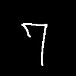

# MNISTを使って学習したモデルで本当にうまく学習できてんのか確認用
## 前準備
* MNISTの手書き数字データセットを使って学習を行う．
* データのダウンロードとデータセットを対応形式に変換

```bash
cd $CAFFE_ROOT
./data/mnist/get_mnist.sh
./examples/mnist/create_mnist.sh
```

* 学習を実行させる前に`./examples/mnist/lenet_solver.prototxt`の内容確認
* CPUのみを使う場合は最後の行を`solver_mode: CPU`に

###学習の実行

```bash
cd $CAFFE_ROOT
./examples/mnist/train_lenet.sh
```

学習が完了したら，`lenet_iter_10000.caffemodel`等が`./examples/mnist/`に生成される．
確認用プログラムはこのファイルネームで参照している．

###学習結果の確認
グラフを出したかったら，下のURL参照

> CaffeでMNISTを学習した経過をプロットしてみた  
> http://iamrobotandproud.hatenablog.com/entry/2015/03/16/105746

## 自分が書いた手書き数字で試してみる
本レポジトリを`./examples/mnist/`に`clone`

```bash
cd examples/mnist
git clone https://github.com/Ry0/num_classify.git
```

0から9までの数字データをテスト用に`image`フォルダにおいているので，これを使って確認してみる．

```bash
cd num_classify
python num_classify.py image/7.jpg
```

###結果
入力画像がこれ  



実行結果の最後らへんに最も確率の高い数字とその他の数字である確率を表示．
配列に格納されているラベル名の順番は0,1,2,...,9．

```bash
input image is " 7 " ＼(^o^)／
[[  1.96383474e-03   8.29961523e-03   2.21462222e-03   3.31178913e-03
    4.37099580e-03   1.27707943e-01   5.20298083e-04   8.18542778e-01
    2.00894289e-02   1.29787195e-02]]
```

###参考
自分で作成する画像はグレースケール画像じゃないとエラーがでる．
GIMPで作るなら設定を変えるか，Imagemagickを使って変換する．

```bash
convert img.png -type GrayScale img_gray.png
```
